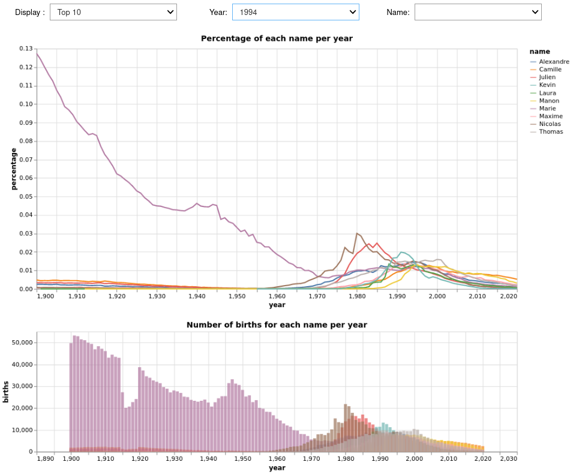
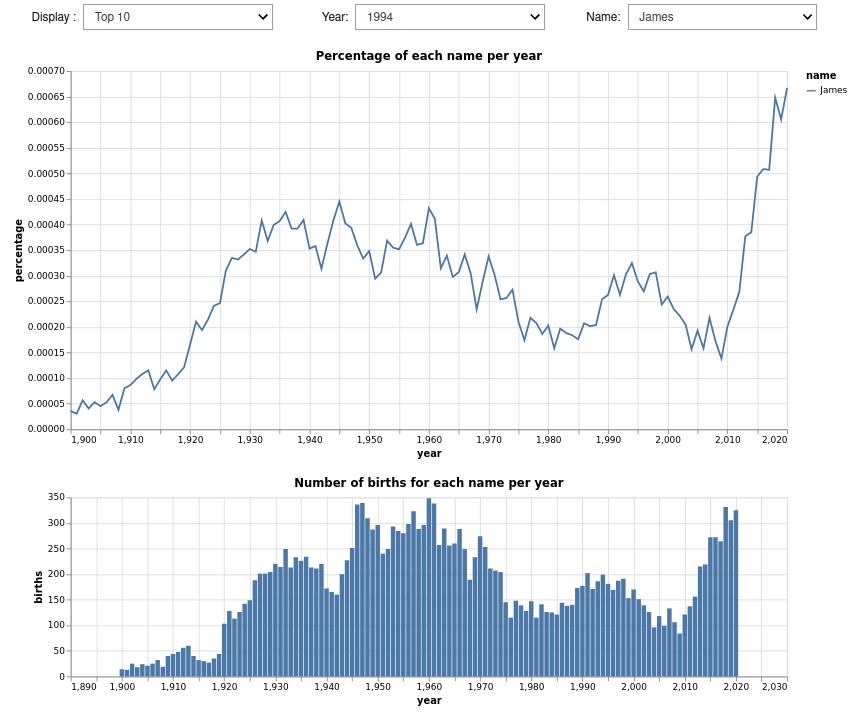

# Description of visualization 01
## Introduction
This visualization intends to answer to following questions:
* How do baby names evolve over time? 
* Are there names that have consistently remained popular or unpopular? 
* Are there some that have were suddenly or briefly popular or unpopular? 
* Are there trends in time?

The general idea is to use a lineplot with the x axis representing the year to help answering the above questions by putting in evidence the evolution of baby names over time and any "outliers" that may appear in the data.

In order to design this data visualization we can start by the first question: *How do baby names evolve over time?* This question can be interpreted in two ways: 1. How do each name evolve over time? 2. How does the distribution of names evolve over time? We though that both are equally relevant and linked to one another so we want to implement a visualization that can answer both interpretations. We can see this as a macro vs micro problem. In this case a lineplot of the attribution of each name over time would help us answer these. Our idea is to show the evolution of the percentage of annual births for each name during time. In order to do this we can aggregate the data per year and remove the detail per department and plot the number of annual births for each name (on a national level) divided by total annual births during the year. We think that this ratio of births better reflects the notion of popularity. We can keep the detail of the number of births in a linked view showing a bar chart of the annual number of births per name. This will allow the user to see all of the data at a glance and see each data case and the overall distribution at the same time. We'll need to implement filters to help unclutter the view and tooltips to add details on demand. We intend to use colors (to encode the name as a categorical value) to distinguish each data case easily. We can use consistent colors for the line plot (which shows a ratio) and the bar chart (which shows the number of births) to tie both views together. Both views could be used to filter by clicking on a name to filter a specific name and have a tooltip that shows more details when hovering a data case. 

To better highlight this macro vs micro problem we want to propose two variants of the visualization with one variant adding an additional chart showing the evolution of global annual births and names diversity over time. This will display the aggregated data and help better show the macro evolution over time.

Let's now have a look at the second and third questions: *Are there names that have consistently remained popular or unpopular? Are there some that have were suddenly or briefly popular or unpopular?* These questions are more targeted at particular data cases (micro problem). One solution to help the user isolate these data cases is to use filters to unclutter the view. The choice of filters options is important here. We can't expect a user to go through each individual names to find names that remain consistently/become briefly popular/unpopular. More over, popular names will probably tend to pop-out as they will be on top (higher numerical values of ratios will be display higher on the y axis), and unpopular names will tend to be at the bottom and thus be less visible. Our idea is to implement filters for popular names (top 5/10) but also on unpopular names (bottom 5/10) to help the user select the relevant data. The top/bottom can filter the most/least popular names for a given year to help see how they evolve through time. Since we also want to let the user select a specific name we'll use two filters: one for top/bottom of a given name and one to filter on a specific name. \

Finally, we can have a look at the last question: *Are there trends in time?* This question will easily be replied since we want to use a lineplot with the x axis representing the year and the y axis representing the ratio of the attribution of a name for any given names. Each line will represent a different name and use a different color to easily help distinguish one from another since position and color are easily separable. This question is also closely linked to the others to answering the previous questions should help answering this last question.

## First proposal
The first proposal consists in a combination of two interactive charts which lets the user to select the data they want to display. At the beginning, only `selectors` are shown. The user needs to use the selector to display the visualization. \
The user must select (`Display` and `Year`) or (`Name`) where `Name` has the highest priority.
* **Display:** filters the number of names to display. If None is selected, all names will be shown. It also needs `Year` to be selected.
* **Year:** filters the year to display.
* **Name:** filters the name to display. 

Here are some use cases:
* This picture shows the result of selecting all years in the `Year` filter.
The lineplot shows the percentage of annual births per name per year from year 1900 to year 2020. The histogram represents the same data but using annual births instead of percentage. \

Thanks to this visualization we can see that there are no names that seem to consistently remain popular.

* Below we are displaying the evolution of top 10 popular names of 1994. The top 10 is done by ranking the percentage of names for the selected year without taking gender into account. \

By selecting the Bottom 5 for All year, we can observe that some names consistently remain unpopular. By selecting the Top 5 of a given year (e.g. 2002) we can see that some names that became briefly popular. On the contrary, by selecting some other year (e.g. 2020) we can observe that some names have been temporarily unpopular.

* In this case, we show the priority of `Name` selector over the two one. So the visualization draws the evolution of name `James` over the time. Values of `Display` and `Year` are not taken into account. \

* User can select a specific name on the lineplot to highlight the curve on both plot. \

## Second proposal
The second proposal is to add some information we found interesting. The lineplot shows that popularity of every name decreases from year to year. To try to understand what is happening we added the evolution of annual births and diversity of names. Thanks to this additional graph we can observe that this is due to the fact that the names attributed are more and more diverse. \

## Limitations
The default view can be a bit cluttered as it shows all the names at the same time (lots of different colors). In this case it is difficult to follow the evolution of a specific name, especially since the names are encoded as a categorical variable through color. Since there are thousands of different names there are as many different colors, which is well over the 12 different colors that is suggested by Ware for cateorical variables. We implemented filters to mitigate this. The filters that we implemented and especially the top/bottom for a year orient the user's choice and may represent a biased view of the data. We can't easily find names that were briefly popular/unpopular, the user has to find them by chance. The user can also feel a bit lost with all the different possible combinations of filters.
