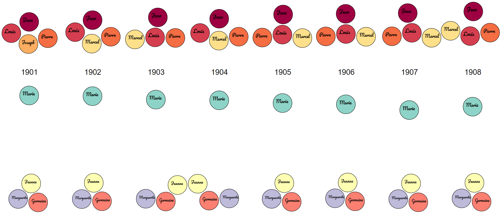
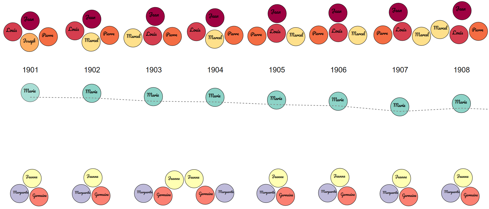

# Description of visualization 03

- Are there gender effects in the data? 
- Does popularity of names given to both sexes evolve consistently?

To answer the question, we have produced a visualization which for each year and each gender displays the top 4 of the most attributed names. It is therefore possible to compare simultaneously the evolution of the most common names among boys (in the upper part) and among girls (in the lower part). Concretely, for each gender, we display the 4 most common names in the form of bubbles classified by number of births along the vertical axis : 

As can be seen in the figure above, the names Jean (#1), Louis (#2), Pierre (#2) and Marcel (#4) were the most common among boys between 1901 and 1908. Regarding girls, the names Marie (#1), Jeanne (#2), Marguerite (#3) and Germaine (#4) are the most common in the same period. We therefore observe in girls and boys the same names that recur over this period of 8 years. However, a more equitable distribution is observed among boys than among girls. Indeed, for grils we observe that the name Marie is much more important than the 3 others while for the boys the 4 names have about the same count.

In order to get an idea of the evolution curve of a name, just pass the mouse over it to display a curve passing through all the bubbles of the considered name over the different years : 

